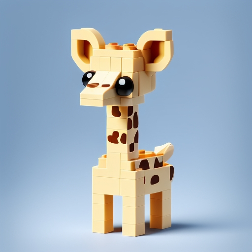
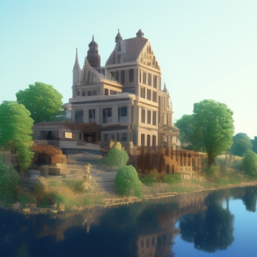

# 🌟 Generador de Imágenes LegoWorld 🧱
## Creado por Oscar Bermúdes y Darío Nievas

## 📌 Descripción
Esta aplicación permite generar imágenes con estilo LEGO utilizando la API de Stable Diffusion. A través de una interfaz interactiva creada con **Streamlit**, los usuarios pueden seleccionar una categoría, añadir detalles y generar imágenes basadas en sus descripciones.

---

## 🛠 Instalación
Para ejecutar esta aplicación en tu máquina local, sigue los siguientes pasos:

### 🔹 Clona este repositorio:
```bash
 git clone https://github.com/tu_usuario/lego-world-generator.git
 cd lego-world-generator
```

### 🔹 Crea un docker:
```bash
 docker compose build
 docker compose up
```

### Recuerda que debes lanzar también Stable Diffusion en un entorno
```bash
 .\sd_env\Scripts\activate
 .\stable-diffusion-webui\webui-user.bat --skip-torch-cuda-test --no-half --use-cpu all --api
```
### 🔹 Instala las dependencias:
```bash
 pip install -r requirements.txt
```

### 🔹 Ejecuta la aplicación:
```bash
 streamlit run app.py
```

---

## 🎨 Uso
1. Inicia la aplicación y accede a la interfaz web generada por **Streamlit**.
2. Selecciona una categoría de imagen: _"Human"_, _"Animal"_, _"Object"_ o _"Scenery"_.
3. Introduce detalles adicionales en la casilla de texto _(opcional)_.
4. Ajusta el número de imágenes a generar.
5. Presiona el botón **"🚀 Generar Imagen"** y espera a que el modelo genere las imágenes.
6. Las imágenes generadas aparecerán en la pantalla.

---

## 🖼️ Ejemplo de Imágenes Generadas
A continuación, algunas imágenes generadas por la aplicación:

### 🌸 Flower


### 🧑 Humano


### 🦒 Jirafa


### 🌊 Lago


---
📌 _Disfruta generando imágenes en estilo LEGO con esta herramienta fácil de usar._ 
[Aplicación en Streamlit](https://stablediffusion-webui-oscar-dario.streamlit.app/)
